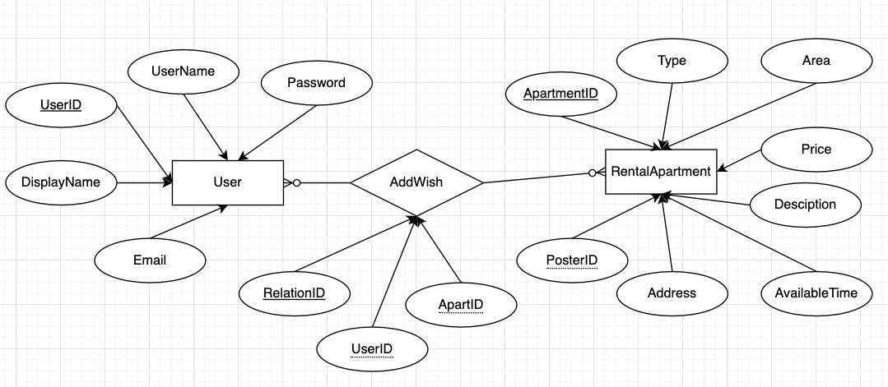
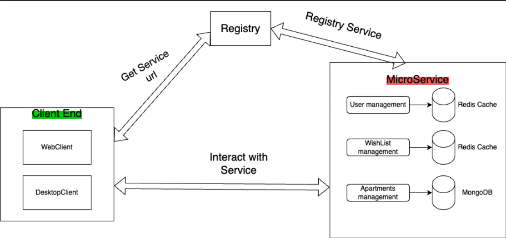

# Apartment Rental System

This application streamlines housing transitions in university towns, focusing on ease of subleasing for students and professionals. It’s a straightforward solution for quick and efficient apartment transfers, addressing the unique challenges of relocating and finding short-term housing.  

This video describes how our program is used: https://www.youtube.com/watch?v=F66DuiSGnJY 

## Table of Contents

- [Installation](#installation)
- [Getting Started](#getting-started)
- [Database Design](#database-design)
- [Architecture](#architecture)

## Installation
1. Download and install [JDK 20](https://www.oracle.com/java/technologies/downloads/).
2. Install [IntelliJ IDEA](https://www.jetbrains.com/idea/) or [Visual Studio Code](https://code.visualstudio.com/).
3. Clone the project repository:
   ```bash
   git clone https://github.com/your-repository.git
   
## Getting Started 
Save this project file to the folder you want. And open it using IntelliJ IDEA or other IDEs.

This video shows how to download and run the project in the IntelliJ IDEA: https://youtu.be/b2srhJ-j1xY 

## Database Design
This image shows the structure of our database Design


## Architecture
### Microservices
3 servers with 11 microservices, grouped by data type.

### Service Registry: 
Manages service discovery and mapping (service code to hostname, address, port).

### Clients
- **WebUI**: Web-based user interface.
- **Desktop Client**: Java Swing frontend, interacts with microservices via service discovery.




